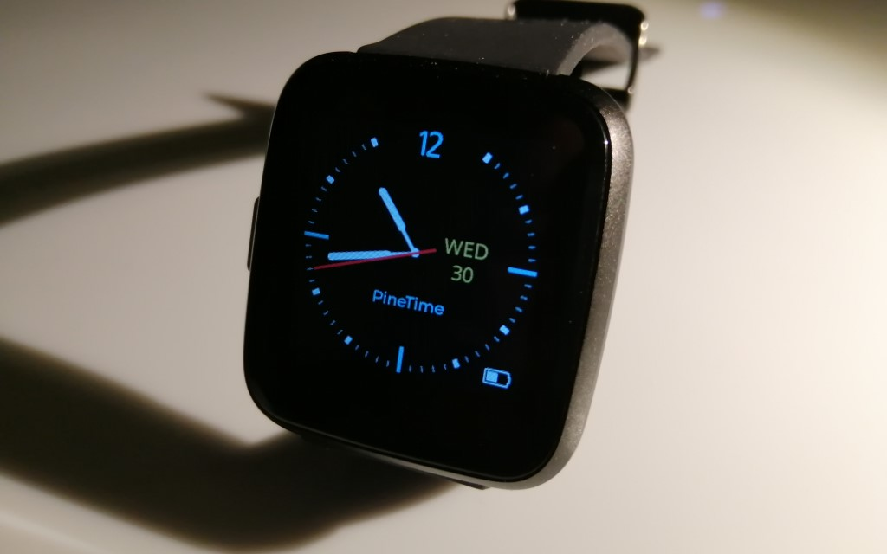
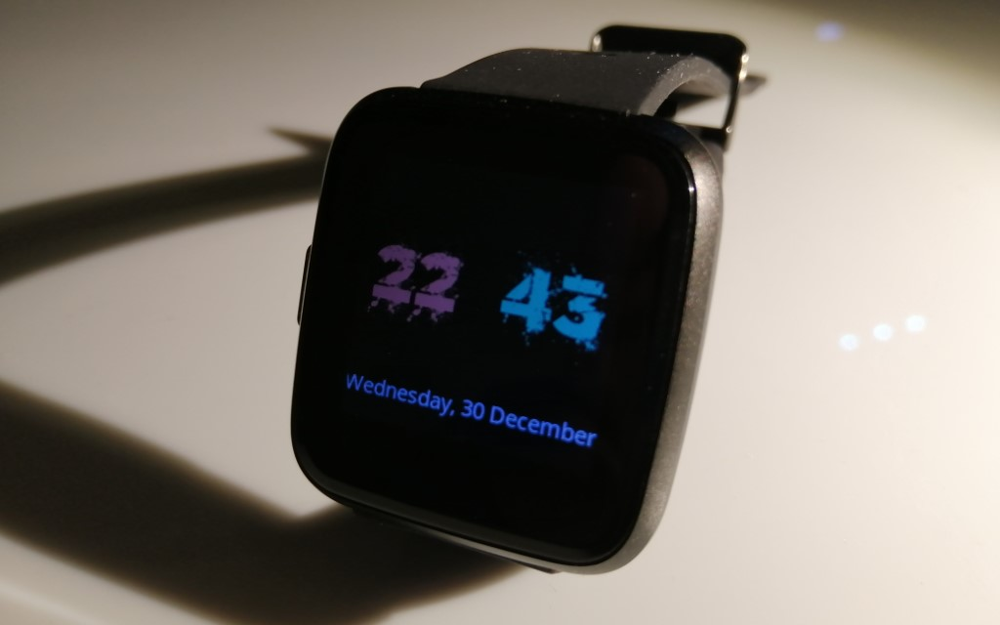
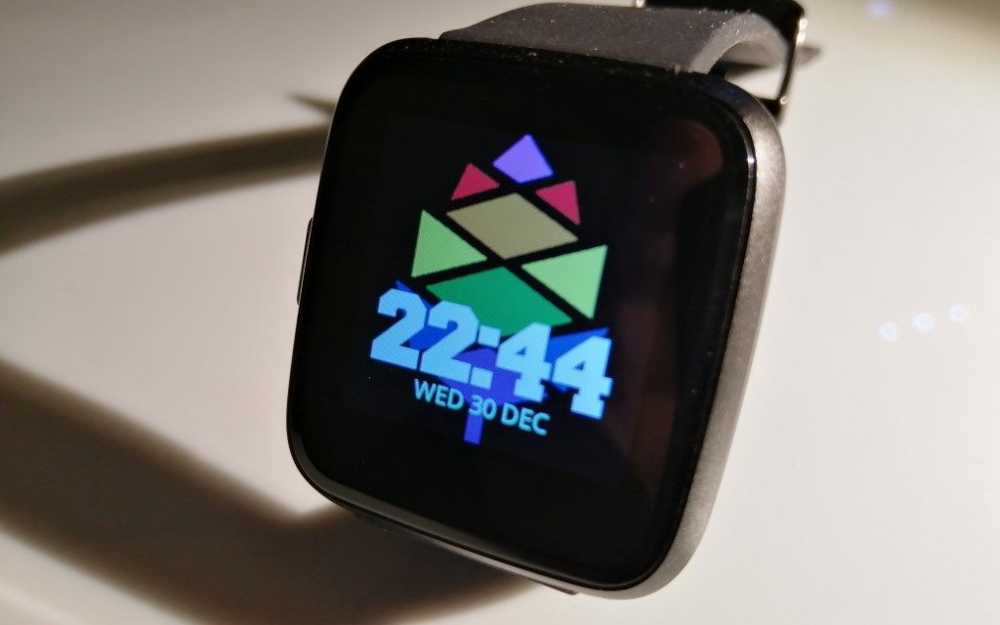
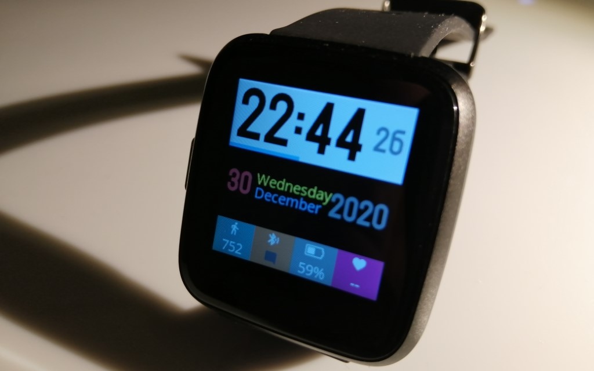
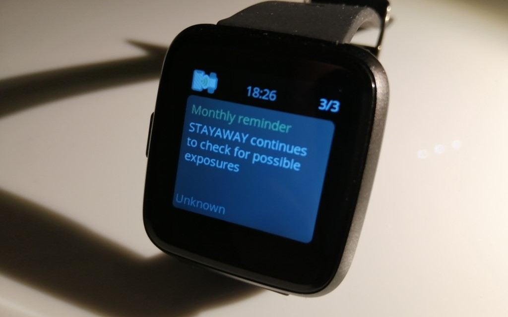
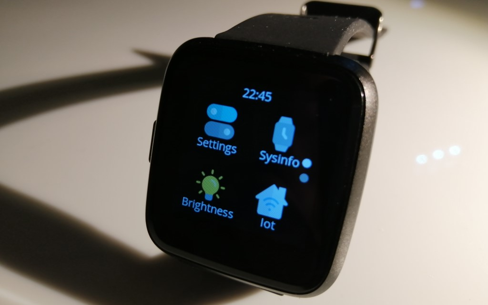
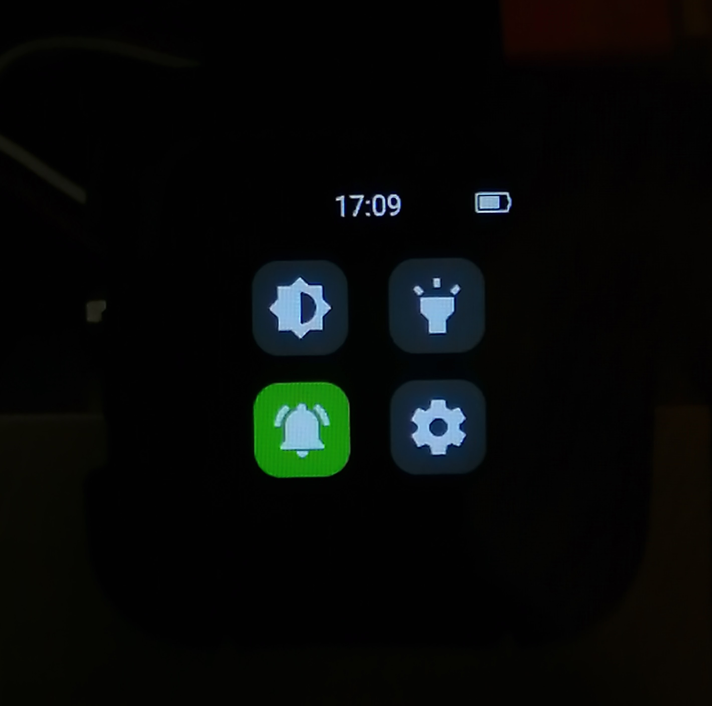
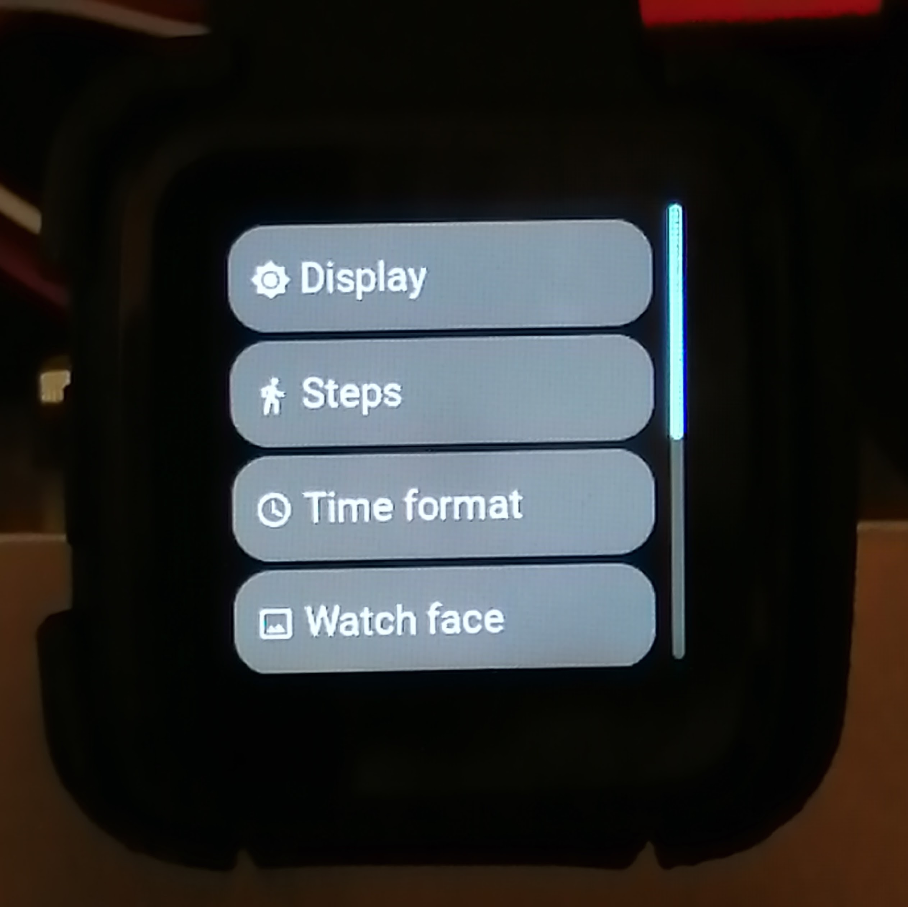
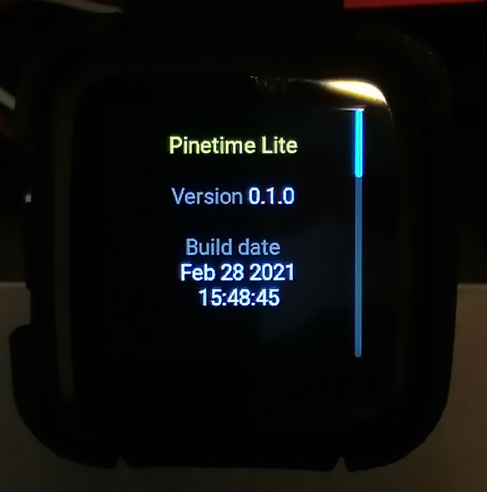

# PineTime

> The PineTime is a free and open source smartwatch capable of running custom-built open operating systems. Some of the notable features include a heart rate monitor, a week-long battery as well as a capacitive touch IPS display that is legible in direct sunlight. It is a fully community driven side-project, which means that it will ultimately be up to the developers and end-users to determine when they deem the PineTime ready to ship.

> We envision the PineTime as a companion for not only your PinePhone but also for your favorite devices — any phone, tablet, or even PC.

*https://www.pine64.org/pinetime/*

The **Pinetime** smartwatch is built around the NRF52832 MCU (512KB Flash, 64KB RAM), a 240*240 LCD display driven by the ST7789 controller, an accelerometer, a heart rate sensor, and a vibration motor.

# PinetimeLite

This project is a fork of [Infinitime](https://github.com/JF002/InfiniTime)

The purpose of **PinetimeLite** is to build firmware for Pinetime that is lightweight and maximizes battery life.
The functionalities to be implemented are:
- Clock, with the possibility of having several faces.
- Notifications, both from applications such as SMS, Whatsapp, etc ... as well as calls.

All other features available on the Pinetime hardware will not be supported.

## Licenses
This project is released under the GNU General Public License version 3 or, at your option, any later version.

## Screenshots

## Screen Mockups

https://www.figma.com/file/Wx1Z5mz2IgCbQDQS8r0Ljr/Pinetime-Screens-v0.1?node-id=0%3A1

----
## Build PinetimeLite

- $ gh repo clone joaquimorg/PinetimeLite
- $ git submodule update --init --recursive

- $ mkdir build
- $ cd build

### Config

cmake -G Ninja

$ cmake -G Ninja -DCMAKE_BUILD_TYPE=Release -DARM_NONE_EABI_TOOLCHAIN_PATH=/usr -DNRF5_SDK_PATH=/mnt/d/Work/PineTime/nRF5_SDK_15.3.0_59ac345 -DUSE_OPENOCD=1 -DOPENOCD_BIN_PATH=/mnt/d/Tools/xpack-openocd-0.10.0-15/bin/openocd.exe ../

cmake -DCMAKE_BUILD_TYPE=Release -DARM_NONE_EABI_TOOLCHAIN_PATH=/usr -DNRF5_SDK_PATH=/mnt/d/Work/PineTime/nRF5_SDK_15.3.0_59ac345 -DUSE_OPENOCD=1 -DOPENOCD_BIN_PATH=/mnt/d/Tools/xpack-openocd-0.10.0-15/bin/openocd.exe ../

##### Sync time on WSL2
$ sudo hwclock -s

##### regular build
$ make -j pinetime-lite
$ ninja pinetime-lite

##### mcboot build
$ make -j pinetime-mcuboot-lite

##### build and upload script
$ bp.sh

##### upload via remote openocd

$ arm-none-eabi-gdb.exe --batch -ex="target extended-remote 192.168.1.20:3333" -ex "load" -ex "monitor reset" src/pinetime-lite-0.1.0.out

arm-none-eabi-gdb.exe -ex="target extended-remote 192.168.1.20:3333" src/pinetime-lite-0.1.0.out