# PineTime


> The PineTime is a free and open source smartwatch capable of running custom-built open operating systems. Some of the notable features include a heart rate monitor, a week-long battery as well as a capacitive touch IPS display that is legible in direct sunlight. It is a fully community driven side-project, which means that it will ultimately be up to the developers and end-users to determine when they deem the PineTime ready to ship.

> We envision the PineTime as a companion for not only your PinePhone but also for your favorite devices — any phone, tablet, or even PC.

*https://www.pine64.org/pinetime/*

*https://wiki.pine64.org/index.php/PineTime*


The **Pinetime** smartwatch is built around the NRF52832 MCU (512KB Flash, 64KB RAM), a 240*240 LCD display driven by the ST7789 controller, an accelerometer, a heart rate sensor, and a vibration motor.

# PinetimeLite

This project is a fork of [Infinitime](https://github.com/JF002/InfiniTime)

The purpose of **PinetimeLite** is to build firmware for Pinetime that is lightweight and maximizes battery life.
The available features are :
- Step counter
- Quick settings to change the backlight, notification vibration and flash light
- Charging notification
- Low battery alert
- Notifications, with app identification
- Incoming call notification, you can cancel the call or silence
- Backlight timeout select
- Multi watch faces ( 4 )
- Firmware update from android app

## Companion app (development is in progress):
 - [Gadgetbridge](https://codeberg.org/joaquimorg/GadgetbridgePinetimeLite) (on Android)

## Licenses
This project is released under the GNU General Public License version 3 or, at your option, any later version.

## Screenshots

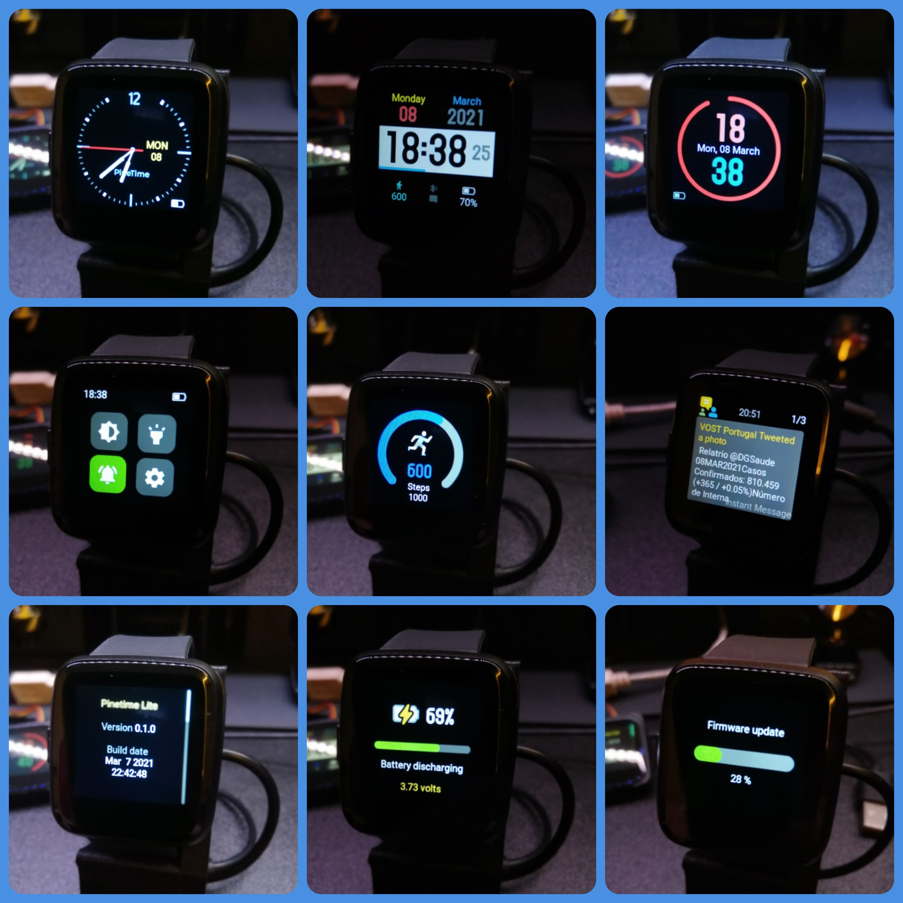

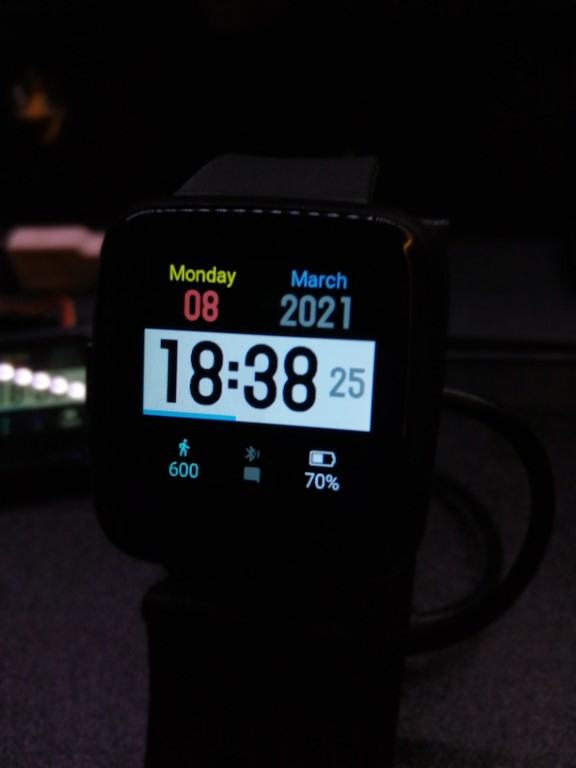

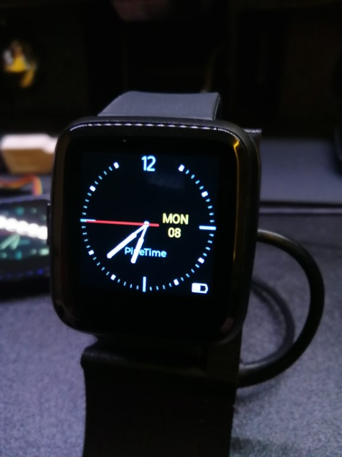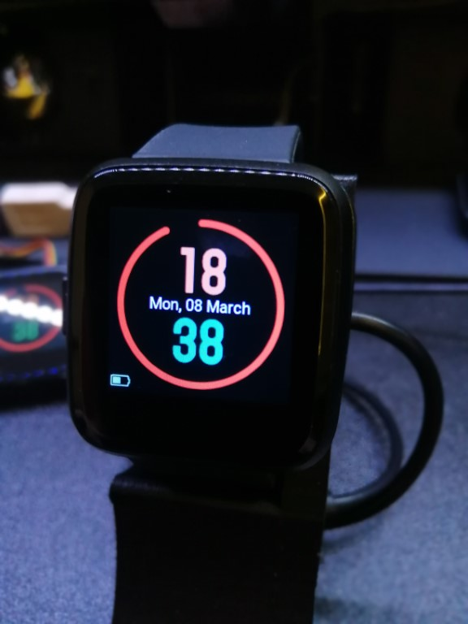
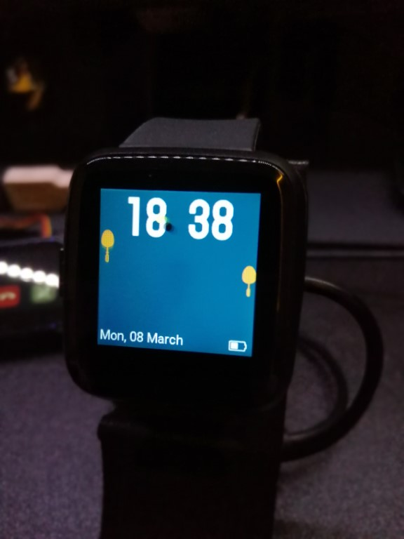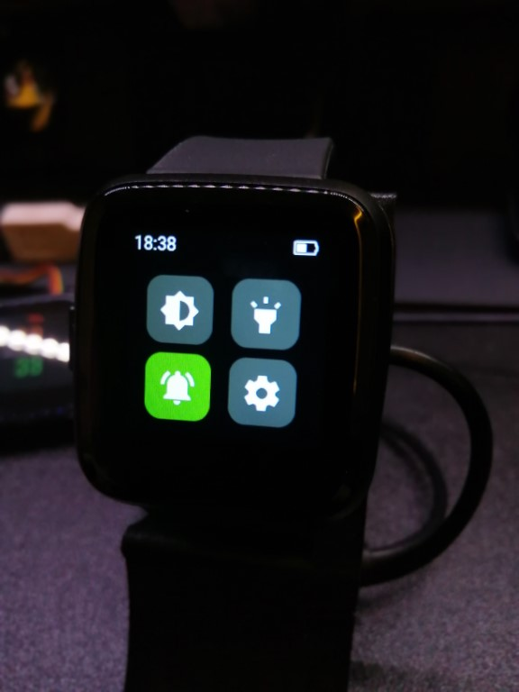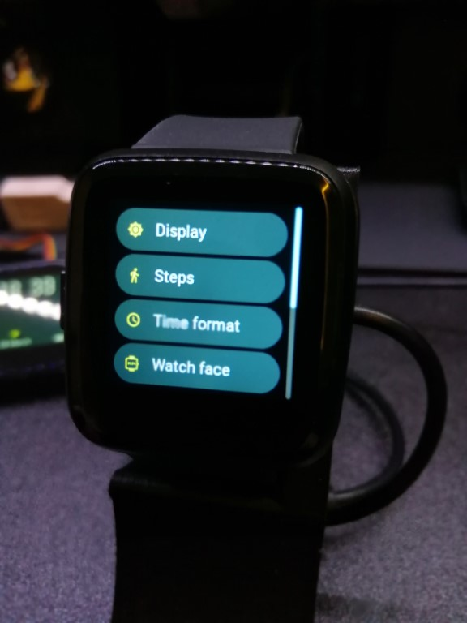
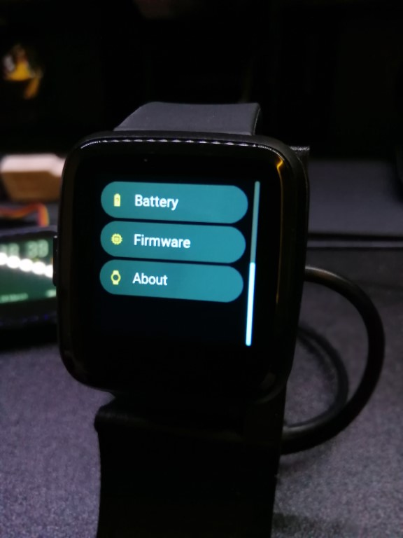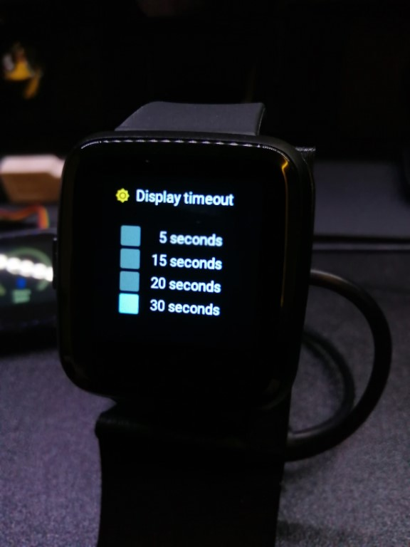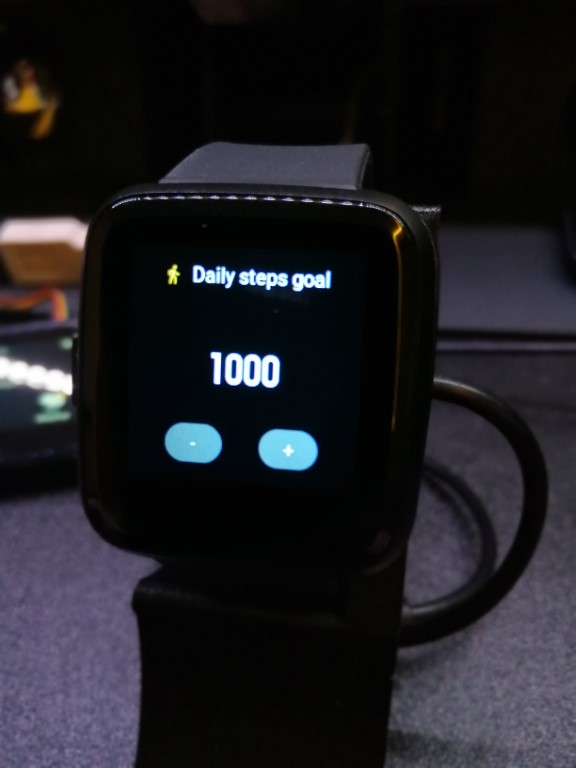
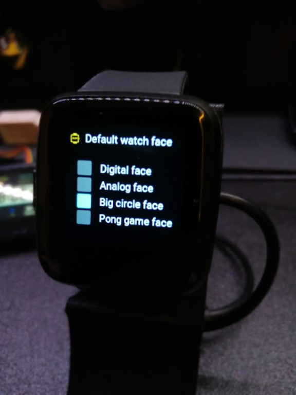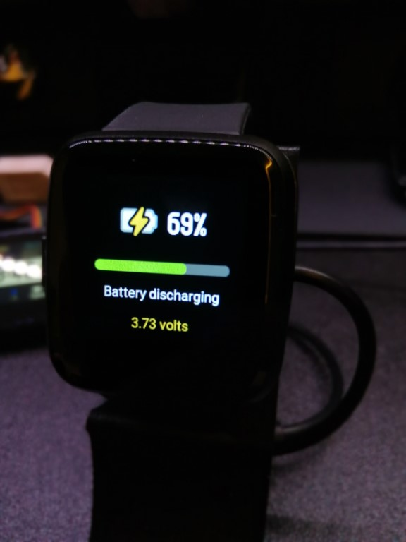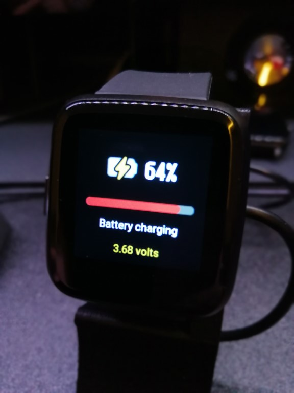
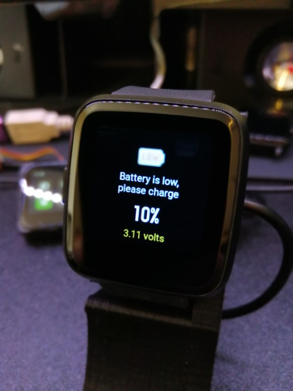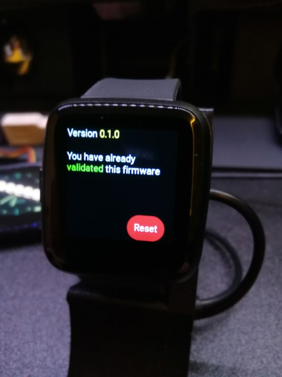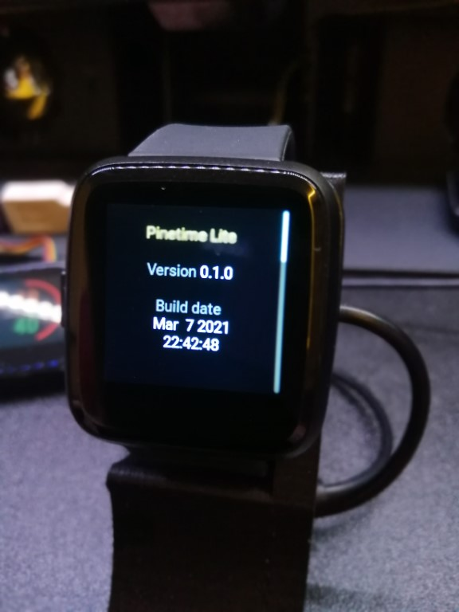
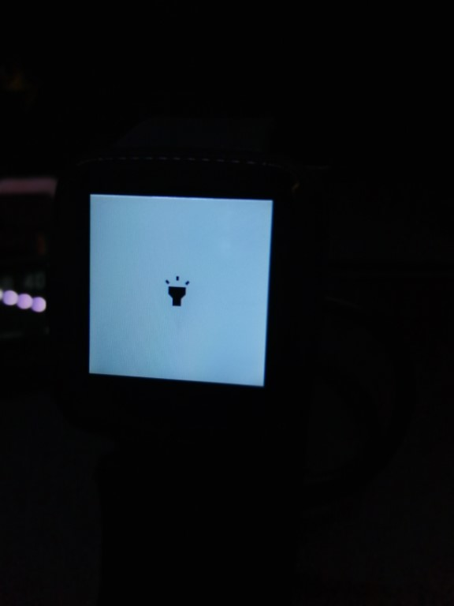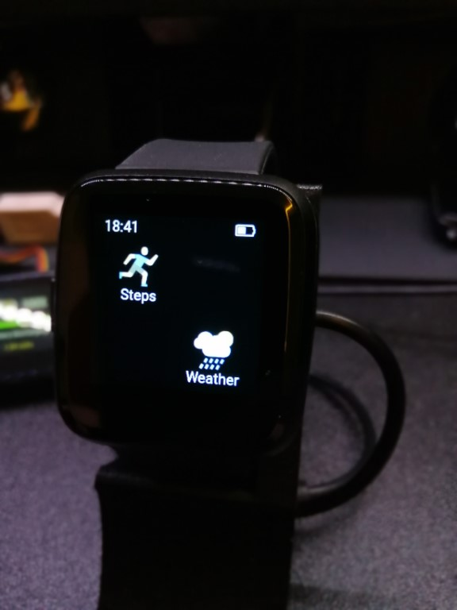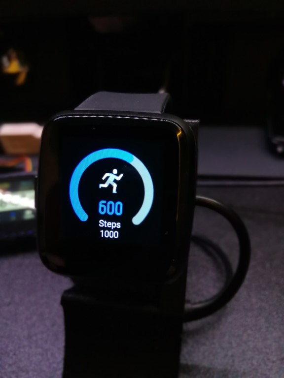
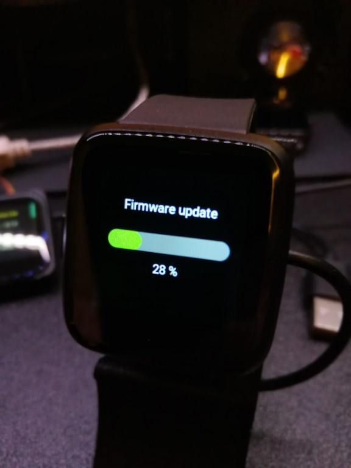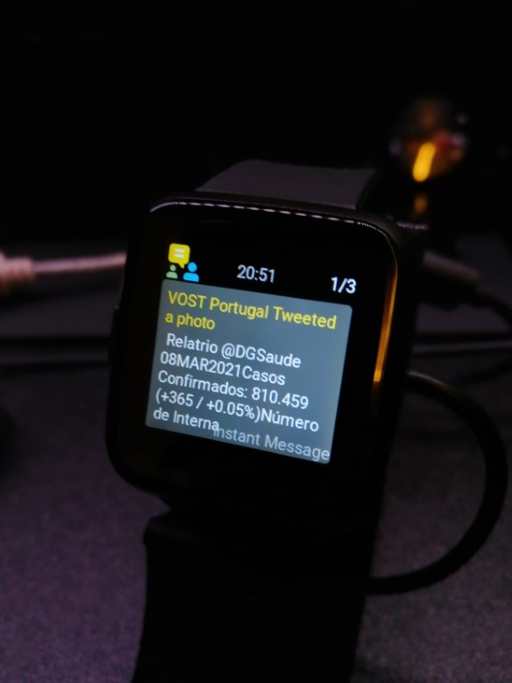

---

[](https://www.youtube.com/watch?v=vJQQdbcaj8U "PineTime Lite 0.1.0")

---

## Screen Mockups

https://www.figma.com/file/Wx1Z5mz2IgCbQDQS8r0Ljr/Pinetime-Screens-v0.1?node-id=0%3A1

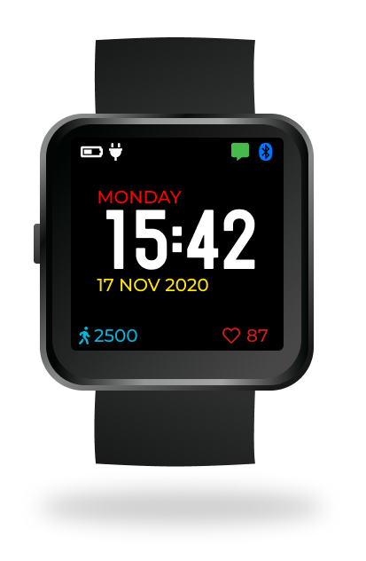

----
## Build PinetimeLite

### I recommend build the project using Docker
This option can be used in Linux and Windows

[Build the project with Docker](doc/buildWithDocker.md)

### Dependencies to build this project, you'll need:

- A cross-compiler : [ARM-GCC (9-2020-q2-update)](https://developer.arm.com/tools-and-software/open-source-software/developer-tools/gnu-toolchain/gnu-rm/downloads/9-2020-q2-update)
- The NRF52 SDK 15.3.0 : [nRF-SDK v15.3.0](https://developer.nordicsemi.com/nRF5_SDK/nRF5_SDK_v15.x.x/nRF5_SDK_15.3.0_59ac345.zip)
- A reasonably recent version of CMake (> 3.16)

```
$ git clone --recurse-submodules https://github.com/joaquimorg/PinetimeLite.git
$ mkdir build
$ cd build
```
##### Config

```
$ cmake -DCMAKE_BUILD_TYPE=Release -DARM_NONE_EABI_TOOLCHAIN_PATH=/usr -DNRF5_SDK_PATH=/mnt/d/Work/PineTime/nRF5_SDK_15.3.0_59ac345 -DUSE_OPENOCD=1 ../
```

More detail information where [Build the project](doc/buildAndProgram.md)
##### regular build
```
$ make -j pinetime-lite
```
##### mcboot build
```
$ make -j pinetime-mcuboot-lite
```
---
## Using Windows WSL2 and STLINK V2 to Build and Upload via OpenODC

##### In Windows :
- Install Docker in Windows
- Download [xpack-openocd-0.10.0-15](https://github.com/xpack-dev-tools/openocd-xpack/releases)
- Configure Openocd to allow remote connections from WSL2
  to do this, in the bin folder create a .bat file with this :
  ```
  openocd.exe -s ..\scripts\ -f interface\stlink.cfg -f target\nrf52.cfg -c "bindto 0.0.0.0"
  ```
  run the .bat file and verify if the connection to Pinetime is ok
  this is the result :
    ```
    Info : Listening on port 6666 for tcl connections
    Info : Listening on port 4444 for telnet connections
    Info : clock speed 1000 kHz
    Info : STLINK V2J29S7 (API v2) VID:PID 0483:3748
    Info : Target voltage: 3.226772
    Info : nrf52.cpu: hardware has 6 breakpoints, 4 watchpoints
    Info : starting gdb server for nrf52.cpu on 3333
    Info : Listening on port 3333 for gdb connections
    ```
    Leave the OpenOCD window open while programing the PineTime.
##### In WSL :
- [Build the project with Docker](doc/buildWithDocker.md)
    ```  
    cd <project_root> # e.g. cd ./work/PinetimeLite
    docker run --rm -it -v $(pwd):/sources pinetime-build
    ```
- Next, this is only for the first time :
  * Find you computer IP, the connection between WSL and windows can only be done via IP
  * Install the "GNU Arm Embedded Toolchain"
- Programing the bootloader, do this only if necessary, the comand will erase all memory in the Pinetime
  ```
  arm-none-eabi-gdb --batch \
  -ex="target extended-remote XXX.XXX.XXX.XXX:3333" \
  -ex "monitor halt" \
  -ex "monitor nrf5 mass_erase" \
  -ex "monitor program <project_root>/build/output/bootloader.bin 0x00000000"
  ```
  replace <project_root> with the full path to your project.
  replace XXX.XXX.XXX.XXX with you computer IP.

- Programing the Pinetime-Lite to Pinetime
    ```
    arm-none-eabi-gdb --batch \
    -ex="target extended-remote XXX.XXX.XXX.XXX:3333" \
    -ex "monitor program <project_root>/build/output/pinetime-lite-0.1.0.bin 0x00008000" \
    -ex "monitor reset"
    ```
    replace <project_root> with the full path to your project.
    replace XXX.XXX.XXX.XXX with you computer IP.

- In this fork you have 3 shell script to automate this steps
  * bdfu.sh - bilds with docker
  * p.sh - programs the Pinetime-Lite via OpenOCD
  * pboot.sh - clean the internal storage and programs the bootloader
