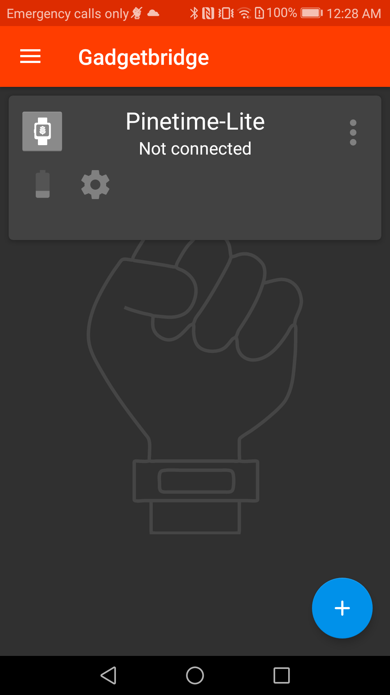
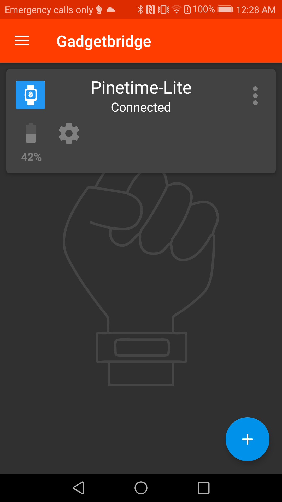
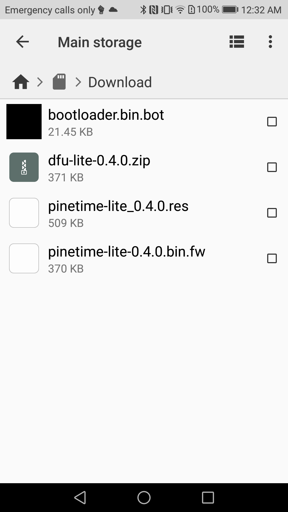
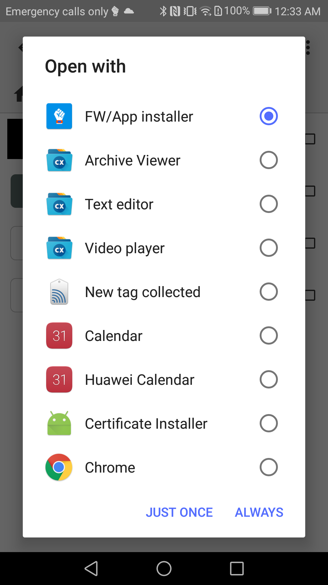
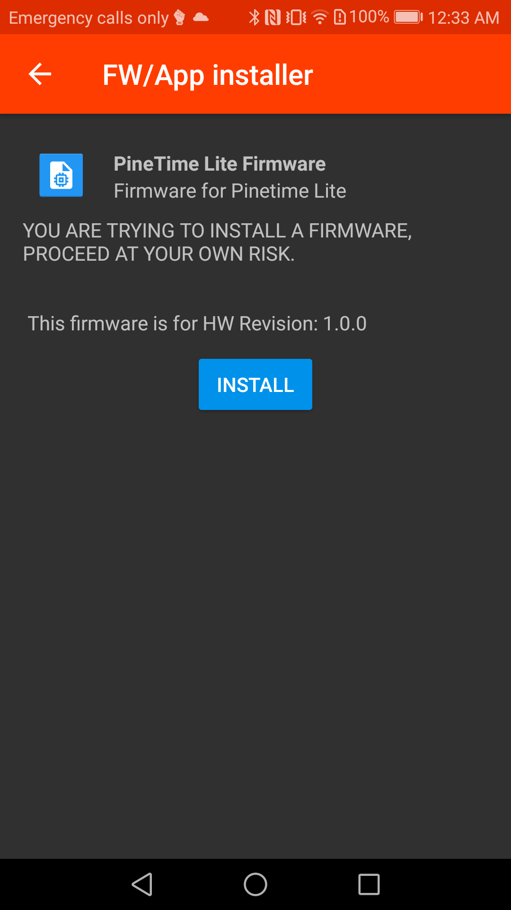

# Instaling PineTime Lite with Gadgetbridge

* Open the app and connect to PineTime Lite

 

* Open you favorite file explorer and select the file to upload

* The supported files are :

  * .bot - Bootloader file

  * .fw - Firmware file

  * .res - Resources file

  * .zip - DFU Firmware, not supported in version after 0.2.0

* If asked select to open the file with **Other**

* And next "Open with" **FW/App installer**

* The last step is to upload the selectd file to the smartwatch

 
